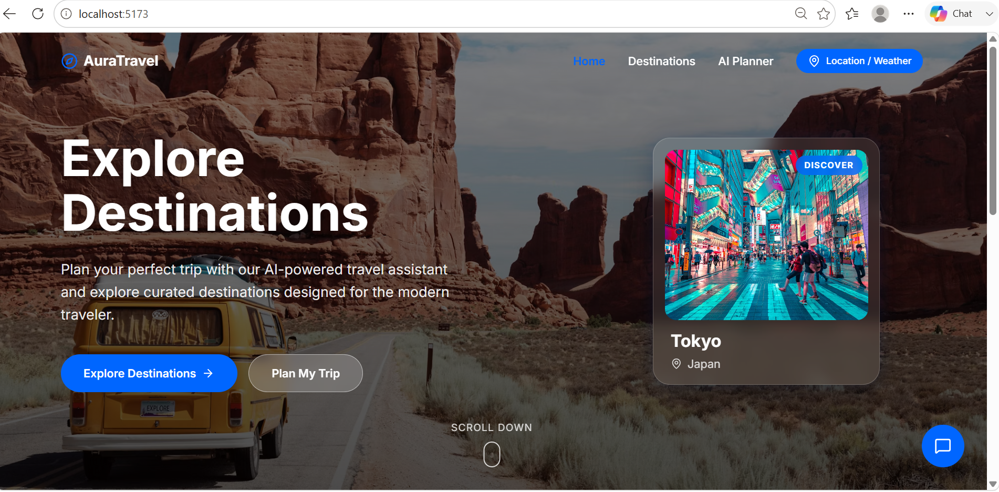
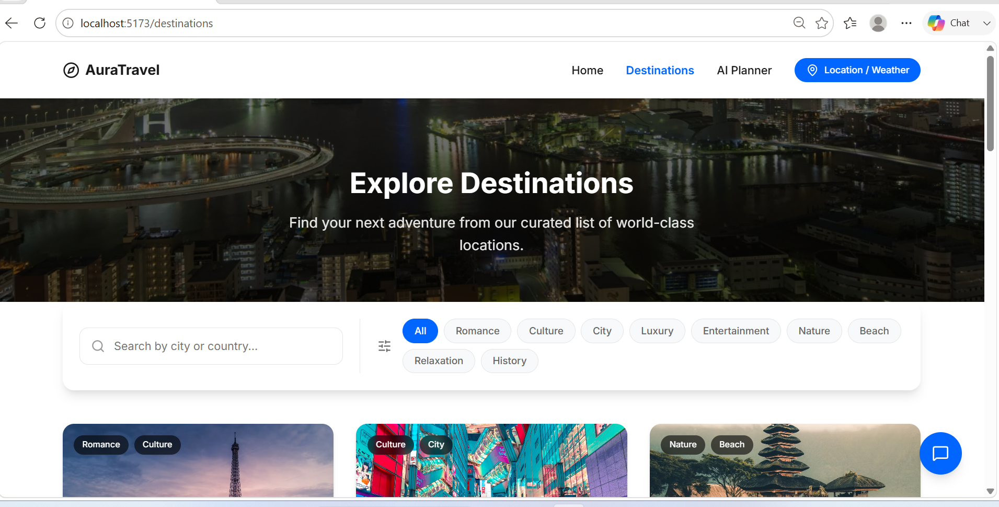
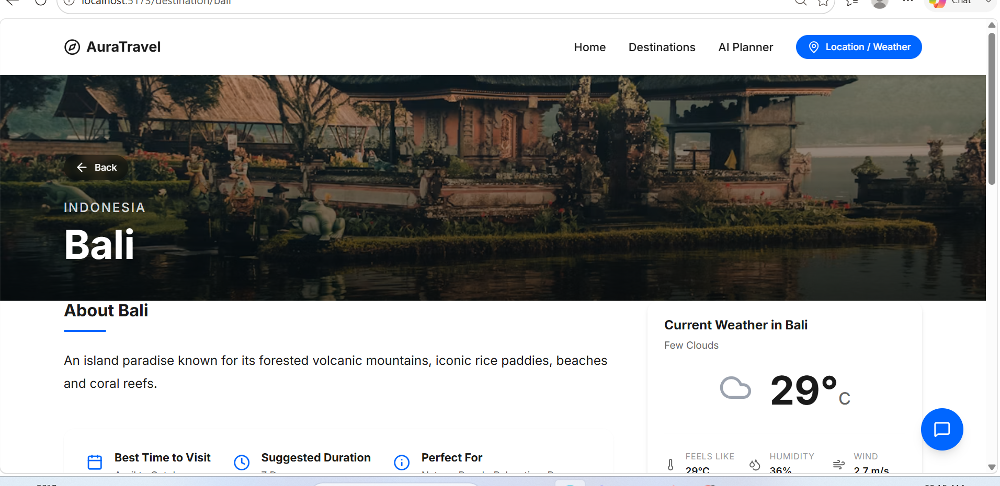
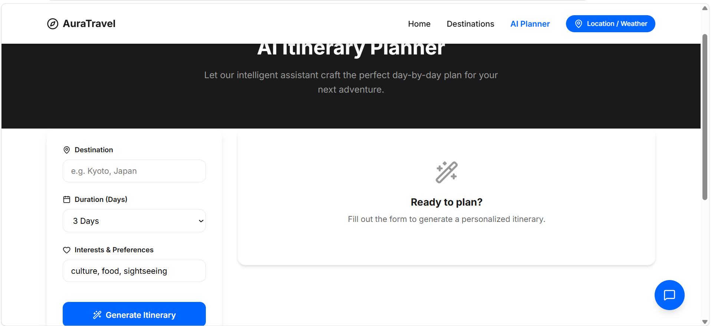
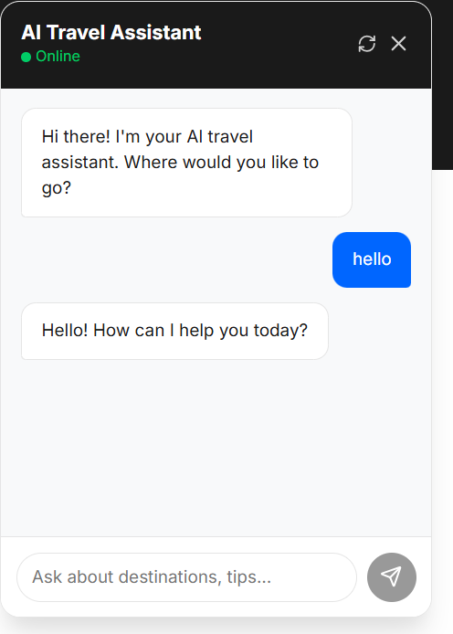
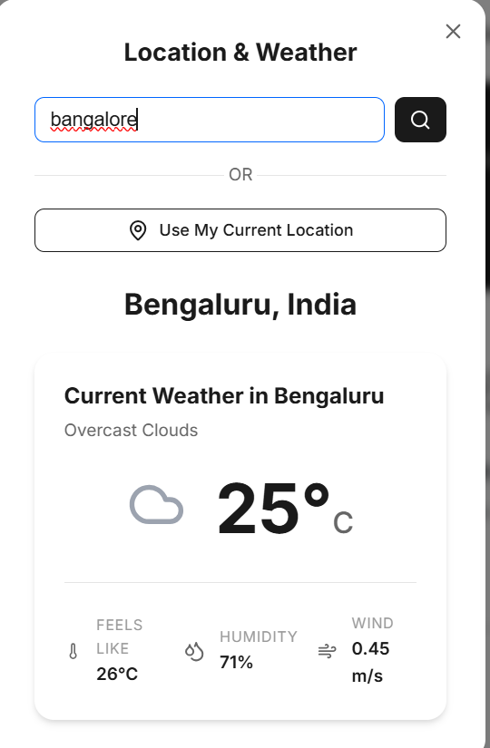

# AuraTravel

AuraTravel is a premium, modern, design-led travel web application built with React and Vite. It helps users explore destinations around the world, discover famous places, see real-time weather, use their current location, and plan personalized itineraries with the help of an AI travel assistant.

## Features

- **Immersive Landing Page**: High-quality design, scrolling animations, and a responsive hero section.
- **Destination Explorer**: Search and filter global destinations seamlessly.
- **Destination Details**: In-depth information including famous places, travel highlights, and weather.
- **Location Awareness**: Geolocation integration to provide hyper-local weather.
- **AI Travel Assistant**: Chat with an AI assistant for real-time travel advice.
- **AI Itinerary Planner**: Generate a detailed, day-by-day travel plan based on your destination, duration, and interests.
- **Premium Design System**: Built with strict CSS modules, custom variables, and elegant typography. No CSS frameworks used to highlight raw styling capabilities.
- **Accessibility & Responsiveness**: Fully responsive across mobile, tablet, and desktop with ARIA attributes and focus states considered.

## Technologies Used

- **Framework**: React 18
- **Build Tool**: Vite
- **Routing**: React Router DOM
- **Animations**: Framer Motion
- **Icons**: Lucide React
- **HTTP Client**: Axios
- **Styling**: CSS Modules + Global CSS variables

## APIs Used

- **OpenWeather API**: For real-time weather information based on location coordinates.
- **Unsplash API**: To dynamically fetch beautiful destination imagery.
- **Google Gemini API**: Powers the AI travel assistant and itinerary generation.

## Project Structure

```
src/
├── assets/         # Global styles (variables.css, global.css)
├── components/     # Reusable UI components (Navbar, Footer, Cards, Chatbot)
├── pages/          # Application views (Home, Destinations, DestinationDetails, AIPlanner)
├── services/       # API integration layers (imageService, weatherService, geminiService)
├── hooks/          # Custom React hooks (useGeolocation)
├── data/           # Mock destination dataset
├── App.jsx         # Main router setup
└── main.jsx        # Entry point

```

Screenshots/
screenshots/
├── home.png
├── destinations.png
├── destination-details.png
├── AI_planner.png
├── chatbot.png
└── location_weather.png

## Screenshots

### Home Page



### Destinations



### Destination Details



### AI Trip Planner



### AI Travel Assistant



### Location Awareness



## How to Install

1. **Clone the repository** (or download the files).
2. **Navigate to the project directory**:
   ````bash
   cd AuraTravel   ```
   ````
3. **Install dependencies**:
   ```bash
   npm install
   ```

## Environment Variables

This project requires API keys to function correctly.

1. Create a `.env.local` file in the root directory.
2. Add the following variables (see `.env.example`):
   ```env
   VITE_UNSPLASH_API_KEY=your_unsplash_api_key_here
   VITE_OPENWEATHER_API_KEY=your_openweather_api_key_here
   GEMINI_API_KEY=your_gemini_api_key_here
   ```
   _Note: Do not commit your `.env.local` file to version control._

## How to Run Locally

Start the Vite development server:

```bash
npm run dev
```

The application will typically be available at `http://localhost:5173`.

## Deployment Instructions

To build the application for production:

```bash
npm run build
```

This will generate a `dist` folder. You can preview the production build using:

```bash
npm run preview
```

The `dist` folder can be deployed to static hosting services like Vercel, Netlify, or GitHub Pages. Remember to set the environment variables in your hosting provider's dashboard.
